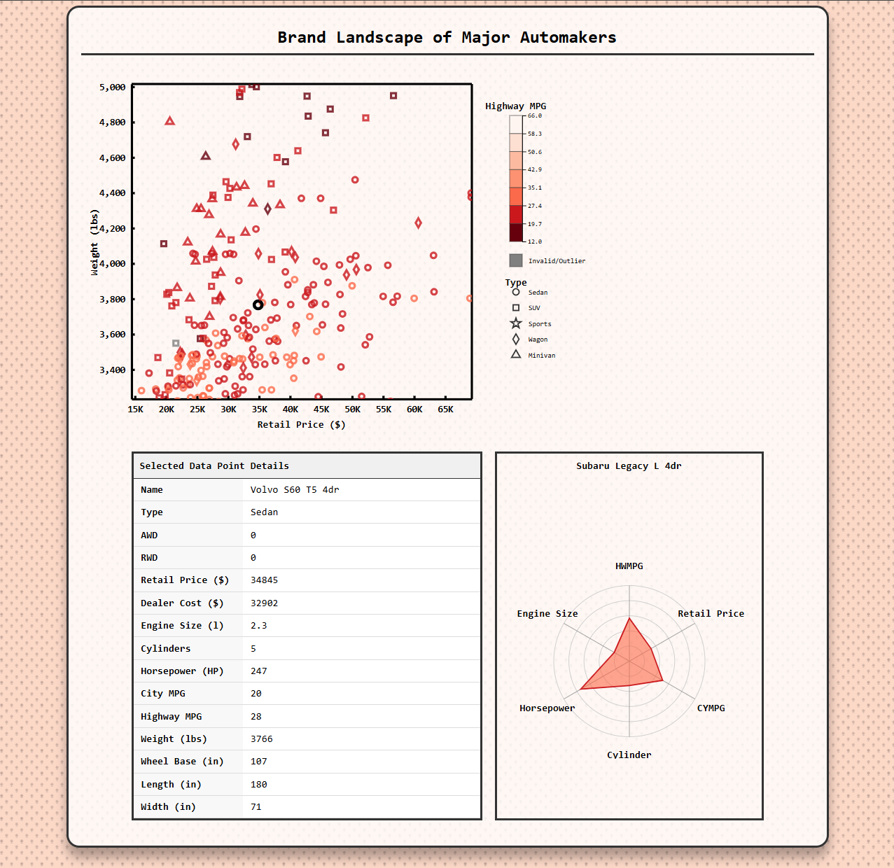

# DataVis Assignment 2

This is my independently completed version of the second assignment of the DataVis course at TU Dresden. 

# ScreenShot

It also contains the sample cars.csv dataset -- remember, it contains some errors! 

## Local development: 
Pre-requisite: [Node.js](https://nodejs.org/en). Install `serve` using: 
> npm install serve --global 

And start the application using 
> serve -p 8000 

You should then be able to see your website at [http://localhost:8000](http://localhost:8000). 

